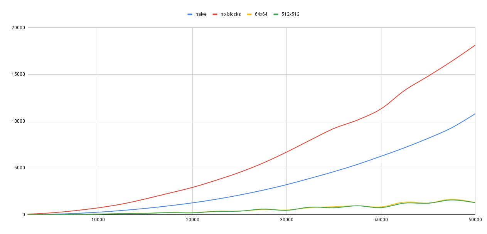

## Cache-oblivious matrix transpose algorithm for Computer Architecture, ITMO University (Dec 2020)

This program compares different approaches of transposing
a square matrix:

1. Naive algorithm (two loops)
2. Cache-oblivious algorithm w/o blocks
3. Cache-oblivious algorithm w/ 64x64 and 512x512 blocks

The 3rd approach is the first two combined, i.e. it tries to minimize the number
of cache misses while handling "small" blocks as in the first approach.

These algorithms were compared by transposing the same square matrices.
Each algorithm was applied 20 times to each of the matrices of size
from 2500 to 50,000 with a step of 2500.

The matrices are filled randomly with numbers from 0 to 9 stored in `char8_t`
type (which was introduced in C++20).

The benchmarks were made by compiling the sources using
GCC 10.2.0 from [MinGW-w64](https://github.com/brechtsanders/winlibs_mingw)
in `Release` mode with `-O3` optimization level. The program was run on an
`Intel Core i7 6850K` running machine.

You can see that the 3rd approach turned out to be the fastest one, almost
independent of the block size. Cache-oblivious algorithm without blocks
(i.e. with 1x1 blocks) seems to be the least efficient.

Full statistics can be found [here](https://docs.google.com/spreadsheets/d/1uhRudLe5n1RtDhlz7ur5ef-Zy96_-FDRbsC2_cTe_g0/).
